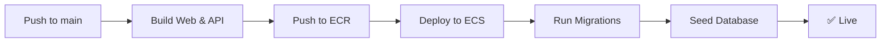

# GitHub Actions CI/CD Workflows

## Workflows

### 1. **CI** (`ci.yml`)
**Trigger:** Pull requests and pushes to `dev` branch

**What it does:**
- Lints and builds web app
- Lints and builds API
- Runs on every PR to ensure code quality

### 2. **Deploy to QA** (`deploy-qa.yml`)
**Trigger:** Push to `main` branch or manual dispatch

**What it does:**
1. **Web deployment:**
   - Builds Docker image with API URL baked in
   - Pushes to ECR
   - Updates ECS service
   - Waits for stable deployment

2. **API deployment:**
   - Builds Docker image
   - Pushes to ECR
   - Updates ECS service
   - Runs database migrations
   - Seeds database (if needed)

**Deployment URL:** http://kolam-ott-qa-alb-146970630.us-east-1.elb.amazonaws.com

### 3. **Seed Database** (`seed-database.yml`)
**Trigger:** Manual dispatch only

**What it does:**
- Runs seed script to create test users
- Can be run on QA or Production

**Test users created:**
- Admin: `admin@kolamott.com` / `Admin@123`
- Premium: `test@kolamott.com` / `Test@123`
- Free: `free@kolamott.com` / `Free@123`

## Required GitHub Secrets

Add these secrets in: **Settings → Secrets and variables → Actions**

```
AWS_ACCESS_KEY_ID      - Your AWS access key
AWS_SECRET_ACCESS_KEY  - Your AWS secret key
```

## Manual Workflows

To run workflows manually:

1. Go to **Actions** tab
2. Select the workflow
3. Click **Run workflow**
4. Choose branch and parameters

## Deployment Process



## Monitoring

**Check deployment status:**
```bash
aws ecs describe-services \
  --cluster kolam-ott-qa \
  --services web api \
  --region us-east-1
```

**View logs:**
```bash
# Web logs
aws logs tail /ecs/kolam-ott-qa-web --follow --region us-east-1

# API logs
aws logs tail /ecs/kolam-ott-qa-api --follow --region us-east-1
```

## Rollback

To rollback to a previous version:

```bash
# Redeploy specific image tag
aws ecs update-service \
  --cluster kolam-ott-qa \
  --service web \
  --force-new-deployment \
  --region us-east-1
```

Or manually trigger the workflow with a specific commit SHA.
